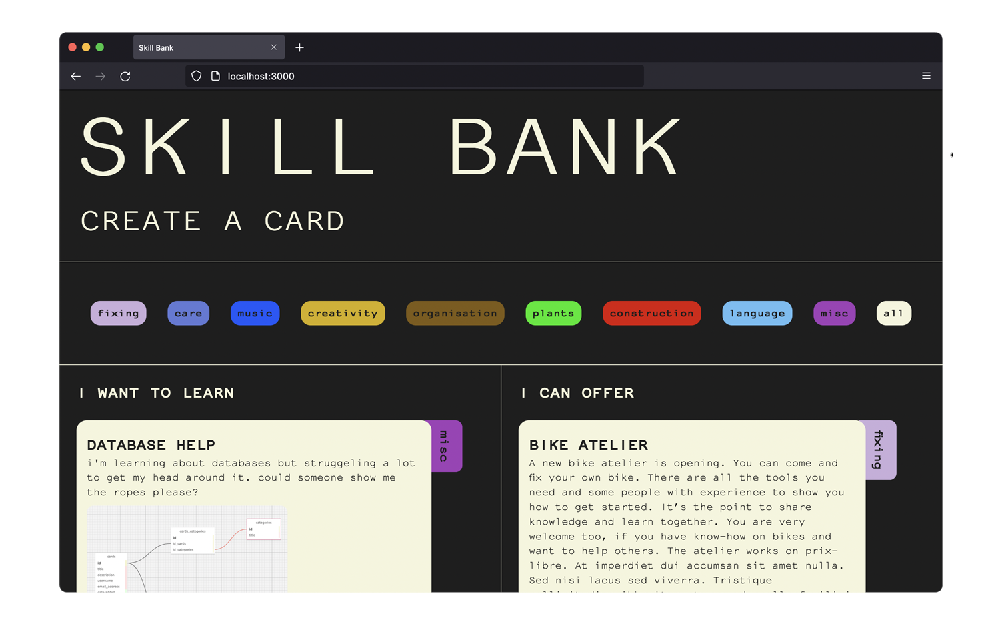
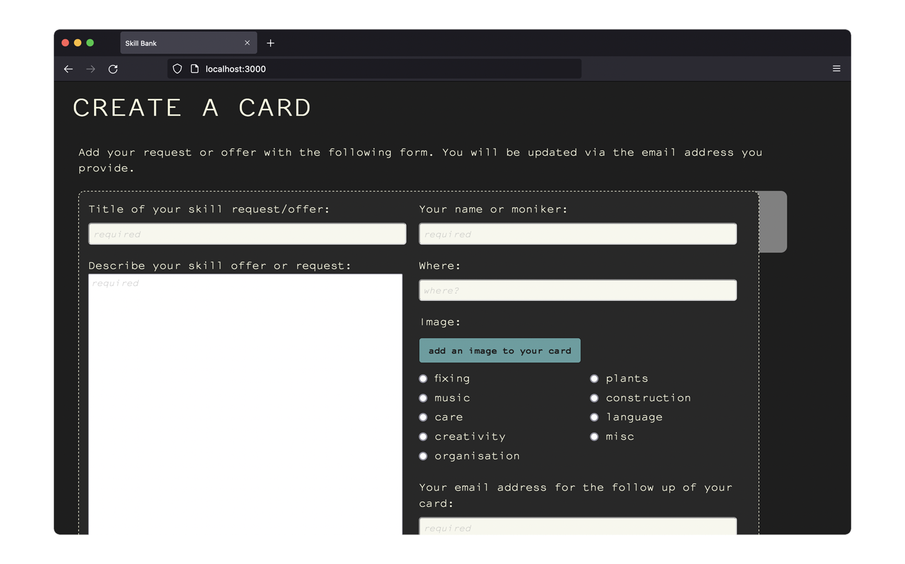

# skillBankApp

This is a project, trying out node and sqlite3. 
It's a prototype for a skill sharing site, which works as a message board on which people can offer or request certain skills or know-how. 

at this stage it's not properly responsive and also not deployed, but i'd like to work towards that in the future.

I developed this project during my studies at the BeCode web dev course.

June 2021

